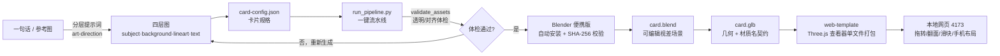

# ✦ RuiC Card Skill

> **🔗 原作者与来源**：本仓库 fork 自 [HRuiCcc/RuiC-card-skill](https://github.com/HRuiCcc/RuiC-card-skill)——技能的设计与实现全部出自原作者 **HRuiCcc**，MIT 许可（见 [LICENSE](./LICENSE)）。
> 本仓库不改动上游代码；ZCode 插件市场的适配与打包进展见 [zai-org/zcode-plugins#21](https://github.com/zai-org/zcode-plugins/pull/21)。

> 一个**通用 Agent Skill**：不挑宿主，**多模态模型都能用**——把小时候文具店门口那种会闪的全息卡**复刻**到浏览器里。
> 说一句话，就得到一张会随视角流光、带层次景深的 3D 闪卡网页，外加一个可以随便改的 Blender 工程。

小时候买不起的闪卡，现在你想印谁就印谁。这是你的私人卡牌工坊。

**它是一台全自动闪卡生产线**：你给一句话或一张参考图，剩下全交给模型——

1. **画四层图**：主体、背景、线稿、文字，画在同一块画布、同一套坐标里
2. **搭 3D 场景**：Blender 建卡牌几何，把四层图按景深在空间里"撑开"——主体前凸、背景后缩
3. **铺全息材质**：镭射彩虹的相位跟着视角走，转到哪闪到哪；烫金 / 银箔 / 珠光 / 原画四种质感
4. **组装网页**：Three.js 查看器打包成单文件，起本地服务，打开页面实测拖拽、翻面、滑块、手机布局
5. **交付**：网页链接 + `card.blend` 源工程 + 四层透明 PNG + `card-config.json` 配置 + 渲染图

技术栈就三样：**Blender**（官方便携版自动安装，不碰系统环境）+ **Three.js**（按同一套 UV 公式重建材质）+ **Python 流水线**（画完图之后一步到位）。skill 本体只有代码和文字，装上就能用；你生成的画作、工程、模型全部待在你自己的项目目录里。

---

## 🎬 演示

### 调整前 · 图层分散

初版层距：主体、特效、文字隔得较开，转动时明显"散开"：


[▶ 观看调整前完整视频](assets/demo-before.mp4)

演示效果由 **DeepSeek V4.1 Flash** 实现。

### 调整后 · 层距收紧（现默认）

调整后：各层收近一档，卡片整体更紧凑，仍保留层次景深——这是当前出厂默认效果：


[▶ 观看调整后完整视频](assets/demo-after.mp4)

演示效果由 **DeepSeek V4.1 Flash** 实现。

---

## ✨ 特性

- **一句话出卡**：描述或参考图 → 分层图 → 配置 → 流水线 → 网页，全程自动，你只负责想
- **不挑宿主、不挑模型**：不绑定某一家——流水线里模型要自己画四层图、自己打开渲染帧判断对不对，所以**只要是多模态模型**（能出图、能看图），配任何读 `SKILL.md` 的宿主都能跑通
- **真 3D 层次景深**：主体前凸、背景后缩，层与层随视角错开，不是一张平面贴图
- **视点流光**：镭射彩虹的相位跟着视角走，转到哪闪到哪；烫金 / 银箔 / 珠光 / 原画四种卡面质感
- **浏览器里随便玩**：拖拽旋转、翻面、景深/光泽/画面比例滑块，手机横竖屏都适配
- **出厂自带验收**：`node scripts/verify_web.mjs <项目>` 自己拉起无头浏览器和本地服务，把拖拽、翻面、缩放、键盘、五个滑块、四种质感、截图下载、390px 窄屏、减动效逐项跑完，并且比对**真实画面帧**（不是只看滑杆读数变没变），报告和截图落进 `verification/`。macOS / Windows / Linux 都能跑，无 GUI 的容器与 root 环境同样直接可用
- **免装 Blender**：官方便携版自动下载、SHA-256 校验后装进项目目录，不污染系统环境
- **网页零依赖请求**：查看器打包成单文件（three + 图标全部内联），广告拦截插件无从下手；即使浏览器关了硬件加速，也有 CSS-3D 分层兜底，绝不会白屏
- **可编辑交付**：`card.blend` 真工程 + 透明分层 PNG + `card-config.json`，想改哪层改哪层
- **纯文本 skill**：本体只有代码和文字，一键打包 ZIP 交付，无二进制、无凭据、无缓存

---

## 🚀 快速开始

### 安装

skill 本体就是 `SKILL.md` + Markdown + 纯 Python/Node 脚本，**不绑定任何宿主，也不绑定任何一家模型**——只要宿主能读 `SKILL.md`、并且跑的是**多模态模型**（能生成图像、能看图），把它放进宿主的 skills 目录就能用（目录名即 skill 名；通用约定是 `~/.agents/skills/`，别的宿主换成自己的 skills 目录即可）。

### 环境

- 模型：**多模态**（要能出图、也要能看图判断渲染帧；纯文本模型做不了这两步）
- Python **3.9+** + Pillow（`ensure_blender.py` 用了 `Path.is_relative_to`，3.6 / 3.8 上会直接报错）
- Node.js + npm
- Blender **不用自己装**——流水线自动把官方便携版放到 `<project>/tools/`，校验 SHA-256。官方源在你的网络里被墙时，用 `RUIC_BLENDER_BASE` 指向镜像即可（例：`RUIC_BLENDER_BASE=https://mirrors.aliyun.com/blender/Blender4.5/`）；校验值取自同一个源，所以镜像要自己信得过
- 验收脚本需要一个 Chromium 内核浏览器：系统装的 Chrome / Edge / Chromium 都行，Playwright 缓存里的 Chromium 也认，还可以用 `RUIC_BROWSER` 或 `--browser` 指定路径。**无 GUI 的 Linux（含 root / 容器）可以直接跑**：脚本在 Linux 上自动补 `--no-sandbox --disable-dev-shm-usage`

### 开口

> "用 RuiC-card-skill 给我做一张水墨风的锦鲤闪卡，文字用书法体，编号 No.001"

或者上传参考图：

> "照这张图做一张闪卡，保留人物和构图，背景换成星空"

它会先把卡片规格说给你听，然后开工：画四层图 → 生成文字层 → 写配置 → 跑流水线 → 起本地服务 → 打开页面实测拖拽、翻面、滑块和手机布局 → 交付。

### 你会收到

| 东西 | 用来干嘛 |
|---|---|
| 本地网页链接（`127.0.0.1:4173`） | 拖、转、翻、拉滑块 |
| `card.blend` | 在 Blender 里继续调材质、换灯光、出渲染 |
| `assets/` 分层图 | 想换哪层换哪层，重跑流水线即可 |
| `card-config.json` | 改名字、编号、稀有度 |
| 渲染图 | 直接发 |
| `verification/` | 自动化验收报告 + 各视角截图，证明这卡真的能拖能翻 |

---

## 🎬 可以拿它做什么

- **猫主子的传说卡**：上传照片加一句"传说稀有度、金边框"，拖一拖，猫往前凸、背景往后退
- **独立游戏卡组**：一个角色一句描述，战士、法师、盗贼、Boss 批量出货，每张卡一个配置
- **团队纪念卡**：头像当主体、部门色当背景、Slogan 当文字层，网页链接一发大家翻一下午
- **节日仪式感**：背面写一句话，对方翻到背面的那一刻，闪光效果拉满
- **发布会彩蛋**：产品卡一个链接"扫码看会闪的那种"，观众当场转起来
- **材质实验场**：`card.blend` 里镭射、星光、线稿发光都是独立可调节点，想学怎么"闪"就打开它

---

## ⚙️ 工作原理

一句话进去，一张会闪的卡出来，中间是一条全自动流水线：



核心链路要点：

- **四层图共用一套 UV 公式**：主体、背景、线稿、文字在 Blender 和网页里按同一公式合成，所见即所得
- **视差不是简单贴图**：把视角方向变换进卡面坐标系、除以有界法向分量，再按带符号景深偏移 UV，才有真正的"层与层错开"
- **全息镭射相位跟着视角走**：转到哪闪到哪，而不是只随时间循环
- **glTF 搬不动节点图**：Blender 的自定义材质图没法经 glTF 直传，网页端用同一套公式重建 shader，并打包成单文件——多个小模块请求会被广告拦截插件误伤，单文件无懈可击
- **Blender 装进项目里**：官方便携版按 SHA-256 校验后解压到 `<project>/tools/`，项目自带环境、互不干扰

---

## 🔧 可以调的旋钮

流水线出厂就是一套顺手的参数，也都留了口子：

- **视差强度**：主体默认 scale 1.25 / depth 0.4，背景 depth -0.25，想更"跳"就往上加
- **特效层**：`assets/effects.png` 可选，独立景深（`effectsDepth`，网页里就是「特效景深」滑块），叠在人物之上、文字之下，适合花瓣/火星/藤刺这类装饰
- **卡框与文字**：都放 `text.png`。网页对文字层不做视差，所以边框会稳稳钉在卡边
- **镭射条纹**：条纹密度、扭曲度、角度，以及粉-黄-蓝-白的渐变
- **线稿发光**：强度和遮罩密度，从"淡淡勾边"到"霓虹描边"
- **星光**：Voronoi 尺度 + 动画噪声，从零星几颗到满天星
- **Blender 界面语言**：默认简体中文，存在项目本地配置里，一句话可换

---

## 📁 目录一览

```
RuiC-card-skill/
├── SKILL.md                    # 宿主读的"操作手册"
├── references/
│   ├── art-direction.md        # 分层画图的提示词写法、参考图处理
│   ├── config.example.json     # 卡片配置示例
│   └── verification.md         # 交付前的验收清单
├── scripts/
│   ├── ensure_blender.py       # 自动获取官方 Blender 便携版
│   ├── build_card.py           # 生成可编辑的 Blender 场景
│   ├── export_web.py           # 导出卡片几何
│   ├── generate_typography.py  # 精确的透明文字层
│   ├── validate_assets.py      # 四层图体检（棋盘格假透明图自动转真 alpha）
│   ├── checkerboard_to_alpha.py # 棋盘格底确定性抠透明（附回归测试）
│   ├── run_pipeline.py         # 一键流水线
│   └── package_skill.py        # 纯文本打包成可分享的 ZIP
└── assets/
    └── web-template/           # 响应式 Three.js 查看器
```

skill 本体只有代码和文字，轻得很。你生成的画作、`.blend`、模型都待在你自己的输出项目里。

---

## 📦 打包分享

想发给朋友或放进仓库：

```bash
python scripts/package_skill.py RuiC-card-skill --out ~/Desktop/RuiC-card-skill.zip
```

按白名单只打包文本文件，打出来的 ZIP 干干净净，拿走就能用。

---

## 赞赏支持

<div align="center">
  
  <p><strong>微信扫码赞赏（原作者 HRuiCcc 的赞赏码）</strong></p>
</div>
